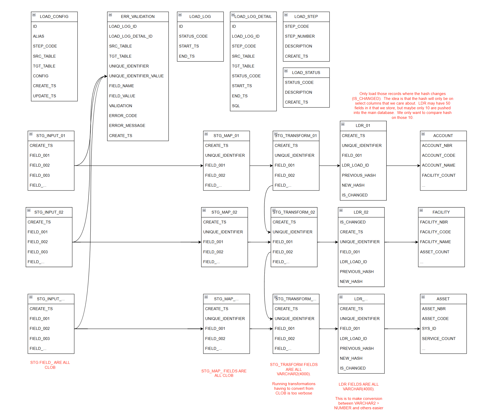

# ldr_oracle

## Description
This project was created as a way to learn Oracle, and build a tool that can be a fully generic loader.  Currently we have 10 of each input tables, which can be scalled to as many as we need.  These tables have 50 columns of type CLOB, so they can accept any input at all thrown at them.

The LOAD_CONFIG table controls how data moves between the STG_INPUT > ERR_VALIDATION > STG_Map > STG_TRASNFORM > LDR > OUT tables.

Here are some sample records thus far in my POC

[ROW_LOAD_CONFIG_ACCOUNT](https://github.com/nealrout/ldr_oracle/blob/develop/sql/row/load_config/ROW_LOAD_CONFIG_ACCOUNT.sql)   
[ROW_LOAD_CONFIG_FACILITY](https://github.com/nealrout/ldr_oracle/blob/develop/sql/row/load_config/ROW_LOAD_CONFIG_FACILITY.sql)   
[ROW_LOAD_CONFIG_ASSET](https://github.com/nealrout/ldr_oracle/blob/develop/sql/row/load_config/ROW_LOAD_CONFIG_ASSET.sql)   
[ROW_LOAD_CONFIG_SERVICE](https://github.com/nealrout/ldr_oracle/blob/develop/sql/row/load_config/ROW_LOAD_CONFIG_SERVICE.sql)   

These configurations currently include validating data, mapping data, in line transformations, and aggregate transformations.  The OUT is still a work in progress, and will be completed shortly.

## Table of Contents

- [Requirements](#requirements)
- [Miscellaneous](#miscellaneous)
- [Usage](#usage)
- [Features](#features)
- [Contact](#contact)

## Requirements
Oracle Express Edition - https://www.oracle.com/database/technologies/xe-downloads.html  
Liquibase CLI (open source)- https://www.liquibase.com/download
## Miscellaneous

## Usage
If the DaaS database does not exist yet, you must create it with a password that you must update. 

  CREATE USER DAAS IDENTIFIED BY UPDATEME;

  GRANT CONNECT, RESOURCE TO DAAS;  
  GRANT CREATE SESSION TO DAAS;  
  GRANT CREATE TABLE TO DAAS;  
  GRANT CREATE VIEW TO DAAS;  
  GRANT CREATE SEQUENCE TO DAAS;  
  GRANT CREATE SYNONYM TO DAAS;  
  GRANT CREATE PROCEDURE TO DAAS;  
  GRANT CREATE TRIGGER TO DAAS;  
  GRANT CREATE MATERIALIZED VIEW TO DAAS;  
  GRANT QUERY REWRITE TO DAAS;  
  GRANT UNLIMITED TABLESPACE TO DAAS;  
  
  ALTER SESSION SET CURRENT_SCHEMA = DAAS;  
  ALTER USER DAAS DEFAULT TABLESPACE users;  

#
To run liquibase migrations:

    Initialization
        liquibase update --url=jdbc:oracle:thin:@localhost:1521/XEPDB1 --contexts=init --username=DAAS --password=UPDATEME

    Migration
        liquibase update --contexts=update --username=UPDATEME --password=UPDATEME

## Features
## Overview
__[PROC_WRAPPER.sql](https://github.com/nealrout/ldr_oracle/blob/develop/sql/procedure/PROC_WRAPPER.sql)__ - Wrapper procedure to determine if we need to recover from a previous failure, or start fresh.  Uses LOAD_LOG AND LOAD_LOG_DETAIL  tables to determine this.

__[PROC_VALIDATE_AND_INSERT_ERRORS.sql](https://github.com/nealrout/ldr_oracle/blob/develop/sql/procedure/PROC_VALIDATE_AND_INSERT_ERRORS.sql)__ -  Procedure to run validations in LOAD_CONFIG, and reject those records to ERR_VALIDATION table.

__[PROC_PROCESS_MAPPED_FIELDS.sql](https://github.com/nealrout/ldr_oracle/blob/develop/sql/procedure/PROC_PROCESS_MAPPED_FIELDS.sql)__ - Procedure to map data between STG_INPUT and STG_MAP.  Dynamic merge statement excluding records in ERR_VALIDATION.

__[PROC_TRANSFORM_INLINE.sql](https://github.com/nealrout/ldr_oracle/blob/develop/sql/procedure/PROC_PROCESS_TRANSFORM_INLINE.sql)__ - Procedure to read inline validations from LOAD_CONFIG, apply them, and move data to STG_TRANSFORM.

__[PROC_TRANSFORM_AGGREGATE.sql](https://github.com/nealrout/ldr_oracle/blob/develop/sql/procedure/PROC_PROCESS_TRANSFORM_AGGREGATE.sql)__ - Procedure to read aggregates from LOAD_CONFIG, appy them, and update them to STG_TRASFORM.

__[PROC_UDPATE_HASHES.sql](https://github.com/nealrout/ldr_oracle/blob/develop/sql/procedure/PROC_UPDATE_HASHES.sql)__ - Procedure that hashes the PREVIOUS_HASH and NEW_HASH, then updates IS_CHANGED field.  This is configuration driven by LOAD_CONFIG.

__[PROC_PROCESS_OUT.sql](https://github.com/nealrout/ldr_oracle/blob/develop/sql/procedure/PROC_PROCESS_OUT.sql)__ - Procedure that reads data from LDR where IS_CHANGED = 1, and then maps the fields to the out tables.  You must supply a target type to convert VARCHAR2(4000) from.

## High level

## Contact
Neal Routson  
nroutson@gmail.com
